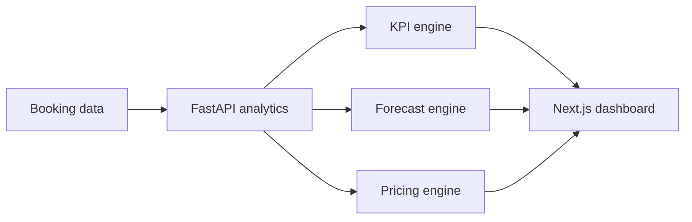

# Hospitality Revenue Intelligence Platform

A full-stack revenue-management portfolio project for monitoring hotel performance, forecasting demand, recommending room rates, comparing properties, and analyzing booking channels, cancellations, and seasonality.

## Capabilities

- Executive KPIs: revenue, occupancy, ADR, RevPAR, cancellations, and booking pace
- Daily revenue and occupancy trends
- Property and booking-channel comparison
- 14-day demand and revenue forecast using recent trend and weekday seasonality
- Explainable pricing recommendations based on occupancy, booking pace, and forecast demand
- CSV ingestion with schema validation
- FastAPI analytics service and Next.js management dashboard
- Reproducible sample dataset, Docker Compose, tests, and GitHub Actions CI

## Architecture



## Core Metrics

| Metric | Formula |
|---|---|
| Occupancy | Rooms sold / Rooms available |
| ADR | Room revenue / Rooms sold |
| RevPAR | Room revenue / Rooms available |
| Cancellation rate | Cancelled bookings / Total bookings |

## Quick Start

```bash
cp backend/.env.example backend/.env
docker compose up --build
```

- Dashboard: http://localhost:3000
- API documentation: http://localhost:8000/docs

The API loads `data/sample_bookings.csv` by default. Upload a replacement CSV through `POST /api/data/upload` using the same columns.

## API

| Method | Endpoint | Description |
|---|---|---|
| `GET` | `/health` | Service health |
| `GET` | `/api/overview` | Portfolio KPIs and daily trend |
| `GET` | `/api/properties` | Property comparison |
| `GET` | `/api/channels` | Channel performance |
| `GET` | `/api/forecast?days=14` | Demand and revenue forecast |
| `GET` | `/api/pricing` | Recommended rates with explanations |
| `POST` | `/api/data/upload` | Replace the active CSV dataset |

## Dataset Columns

`date`, `property`, `channel`, `rooms_available`, `rooms_sold`, `adr`, `cancelled_bookings`, `total_bookings`, `lead_time_days`, `event_index`

## Pricing Logic

The recommendation engine starts with current ADR and applies bounded adjustments:

- high occupancy increases rate;
- low occupancy decreases rate;
- strong booking pace increases rate;
- elevated event demand increases rate;
- every recommendation includes its contributing reasons.

## Production Roadmap

- Connect PMS/CRS data and stream booking changes
- Add probabilistic forecasting and forecast backtesting
- Add room-type inventory and competitor-rate shopping
- Add authentication, tenant isolation, audit history, and approval workflows
- Persist data in PostgreSQL or a cloud warehouse

## License

MIT
